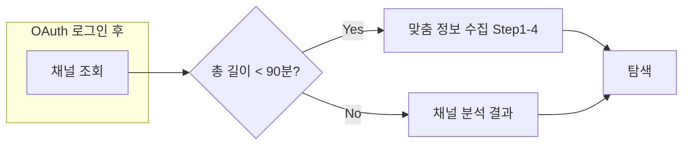

# 온보딩 분기 처리 및 퍼널별 완료 상태

## 목표 플로우 (정리)

- **초보 퍼널**: 총 길이 90분 미만 → [맞춤 정보 수집] → [탐색]
- **숙련 퍼널**: 총 길이 90분 이상 → [채널 분석 결과] → [탐색]

(스펙의 “영상 개수 50개” 분기는 제외하고, **총 길이만** 사용)

---

## 1. 퍼널별 완료 상태 정의

| 퍼널     | 완료 조건                 | 저장 시점                     |
| ------ | --------------------- | ------------------------- |
| **초보** | Step 1~4 제출 후 “탐색” 진입 | “탐색” 클릭 시 또는 Step 4 제출 직후 |
| **숙련** | 채널 분석 결과 화면에서 “탐색” 클릭 | “탐색” 클릭 시                 |

**저장 위치 후보**

- **A)** `User` 또는 `YouTubeChannel` 테이블에 `onboarding_completed_at`, `onboarding_funnel_type` 추가  
- **B)** 기존처럼 “페르소나 존재”만으로 완료로 간주 (추가 스키마 없이, 로직만 정리)

권장: 우선 **B**로 두고, “이 사용자는 초보/숙련 중 어떤 경로로 완료했는지”가 필요해지면 **A**로 확장.

**동작 정리**

- 로그인 후: `getMyPersona()` 성공 → `/dashboard`, 실패(404) → `/onboarding`.
- `/onboarding` 진입 시: **채널 조회(분기) API** 호출 → `beginner`면 맞춤 정보 수집, `experienced`면 (페르소나 생성 후) 채널 분석 결과.
- “탐색” 클릭 시: `/explore`로 이동. 이후 재로그인 시에는 페르소나가 있으므로 `/dashboard`로 가면 됨 (현행 유지).

---

## 2. 백엔드: 채널 조회(분기) API

**역할**: 영상 총 길이만으로 퍼널 판별. 페르소나 생성은 하지 않음.

- **엔드포인트**: `GET /personas/onboarding-funnel` (또는 `GET /channels/onboarding-funnel`)
- **로직**:
  1. 현재 사용자 채널 조회.
  2. 해당 채널의 최근 영상이 없으면 `sync_channel_videos(db, channel_id, max_results=50)` 호출하여 최소 1회 동기화.
  3. `yt_channel_videos`에서 해당 `channel_id`의 `duration_seconds` 합산 → `total_duration_minutes = sum(duration_seconds)/60`.
  4. `total_duration_minutes >= 90` → `experienced`, 미만 → `beginner`.
- **응답** (예시):
  - `200`: `{ "funnelType": "beginner" | "experienced", "totalDurationMinutes": number }`
  - 채널 없음: `404`

**구현 위치**

- [BE/app/api/routes/persona.py](BE/app/api/routes/persona.py): 새 엔드포인트 추가.
- [BE/app/services/channel_video_service.py](BE/app/services/channel_video_service.py): 이미 `sync_channel_videos`, `get_channel_videos` 있음. 합산만 할 서비스 함수 추가하거나, 라우터에서 `get_channel_videos` 결과로 합산.

**스키마**

- [BE/app/schemas/persona.py](BE/app/schemas/persona.py) (또는 새 스키마 파일): `OnboardingFunnelResponse(funnelType, totalDurationMinutes)`.

---

## 3. 프론트엔드: 분기 처리

**진입**

- [FE/src/pages/login/page.tsx](FE/src/pages/login/page.tsx): 변경 없음. 기존대로 페르소나 없으면 `/onboarding`으로 이동.
- [FE/src/pages/onboarding/page.tsx](FE/src/pages/onboarding/page.tsx): **마운트 시** `GET /personas/onboarding-funnel` 호출.

**분기**

- `funnelType === 'experienced'`  
  - (선택) 로딩 UI 표시  
  - `POST /personas/generate` 호출 (기존 `generatePersona`)  
  - 성공 시 → **채널 분석 결과** 화면 렌더 (기존 또는 새 컴포넌트)  
  - “탐색” 버튼 → `navigate('/explore')`
- `funnelType === 'beginner'`  
  - **맞춤 정보 수집** (Step 1~4) 화면 렌더  
  - Step 4 완료 후 제출 시 `generatePersona`(및 필요 시 `updatePersona`) 호출  
  - 이후 “탐색” 또는 “시작하기” → `navigate('/explore')` (또는 스펙에 따라 `/dashboard`)

**API**

- [FE/src/lib/api/services/persona.service.ts](FE/src/lib/api/services/persona.service.ts): `getOnboardingFunnel(): Promise<{ funnelType: 'beginner'|'experienced', totalDurationMinutes: number }>` 추가.
- [FE/src/lib/api/types/persona.types.ts](FE/src/lib/api/types/persona.types.ts): 해당 응답 타입 추가.

---

## 4. (선택) 완료 상태 저장

- 퍼널별 완료 state를 **서버에 남기려면**:  
  - “탐색” 클릭 시 `PATCH /personas/me`에 `onboarding_completed_at: new Date().toISOString()` 같은 필드를 넘기거나,  
  - 전용 `POST /personas/onboarding-complete` 같은 엔드포인트 추가.
- 이 단계에서는 “페르소나 존재 = 온보딩 통과”로 두고, 나중에 퍼널 타입·완료 시각이 필요할 때 위와 같이 확장하면 됨.

---

## 5. 작업 순서 제안

1. **BE**: `GET /personas/onboarding-funnel` 추가 (채널 동기화 + 길이 합산 + funnelType 반환).
2. **FE**: `getOnboardingFunnel` 호출 및 `funnelType`에 따라 기존 `page.tsx`에서 “맞춤 정보 수집” vs “채널 분석 결과” 분기만 먼저 연결 (기존 Step 1 카드/로딩 UI 재사용 가능).
3. (선택) 퍼널별 완료 state를 DB에 저장할지 결정 후, 필요 시 스키마·API·FE 저장 호출 추가.

이후에 스펙대로 Step 1~4를 개별 컴포넌트로 쪼개고, 채널 분석 결과 화면을 스펙에 맞게 다듬으면 됨.