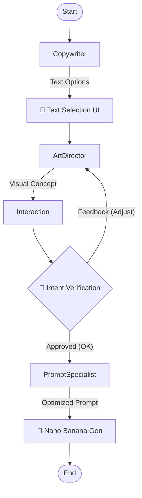

## 🖼️ 4. 썸네일 생성

### 4.0 썸네일 생성 입력 데이터 (Inputs)
*이 모든 데이터가 썸네일 생성 에이전트와 모델에게 전달됩니다.*
- **이미지 에셋 (Image Assets)**
  - 유튜버 인물 사진 (Persona)
  - 썸네일 레퍼런스 사진 (스타일 참고용)
  - 템플릿 이미지 (구조/레이아웃)
  - 키워드 관련 이미지 (배경 및 오브젝트 소스)
- **텍스트 데이터 (Text Data)**
  - 키워드 (AI 에이전트 추출 or 사용자 입력)
  - 스크립트 요약 내용 (Writer Agent 생성)
- **제어 데이터 (Control)**
  - Nano Banana Pro 전용 프롬프트 (Prompt)

### 4.1 텍스트 생성 및 확정 (이미지 생성 전)
요약된 스크립트와 키워드를 바탕으로 에이전트가 텍스트 제안:
- **주제목(Main Title) & 부제목(Subtitle)**: 3가지 옵션 제공 (UI)
- **사용자 선택 및 커스텀**: 제공된 3가지 옵션 중 선택하거나, **직접 입력(Custom Input)** 가능
- *목표*: 이미지 생성 전 텍스트 퀄리티 확보 및 비용 효율성 증대

### 4.2 디자인/컨셉 선택 및 의도 확인 (Verification)
**"사용자의 의도를 AI가 먼저 파악하여 불필요한 재생성 방지"**
- **AI 스타일 제안**: 영상 스크립트 분위기에 맞춰 3가지 시각적 컨셉 제안
  - 예: *[뉴스룸 스타일]*, *[유튜버 리액션 강조]*, *[텍스트 중심 고대비]*
- **기획 의도 확인 (Intent Verification)**:
  - 프롬프트 코드를 보여주는 대신, **AI가 이해한 의도**를 자연어로 요약하여 사용자에게 컨펌 요청
  - *Agent*: "긴박한 뉴스 속보 느낌으로, 배경은 어둡게 하고 텍스트는 빨간색으로 강조할까요?"
  - *User*: 승인(OK) 또는 자연어로 피드백("아니, 배경 좀 더 밝게 해줘")
- **Prompt Engineering Agent**: 사용자 피드백을 반영하여 내부적으로 Nano Banana Pro 전용 고성능 프롬프트 최적화
  - *Reference*: `docs/NANO_BANANA_BEST_PRACTICES.md` (공식 프롬프트 가이드 준수)

### 4.3 썸네일 어시스턴트 (Mini Chatbot UI)
**"복잡한 채팅창이 아닌, 스마트 위젯 형태의 대화형 인터페이스"**
- **역할**: 4.1(텍스트 확정)과 4.2(의도 확인) 단계를 가이드하는 밀착형 도우미
- **UI 형태**: 화면 우측 작업 영역 옆에 위치한 **Smart Widget**
- **기능**:
  - AI 제안 요약 카드 제시 ("이런 느낌으로 만들까요?")
  - 원클릭 스타일 변경 버튼 제공
  - 자연어 피드백 입력창 ("좀 더 밝게 해줘")
  - **Prompt Hiding**: 복잡한 프롬프트는 숨기고, '기획 의도' 위주로 소통

### 4.4 썸네일 이미지 생성
확정된 텍스트와 컨셉(프롬프트)을 기반으로 이미지 생성:
- **이미지 생성 모델**: Nano Banana Pro (Google DeepMind)
- 확정된 주제목/부제목을 반영하여 고품질 썸네일 생성

### 4.5 다운로드
- 고해상도 썸네일 다운로드 (2K/4K)

### 4.6 시스템 설계 및 구현 가이드 (LangGraph)
- **상세 설계서**: `docs/THUMBNAIL_GENERATION_DESIGN.md`
- **핵심 아키텍처**: 4인 에이전트(`Copywriter`, `Art Director`, `Interaction`, `Prompt Specialist`)와 `interrupt_before`를 활용한 인간 참여형(Human-in-the-loop) 워크플로우 구현.


# 🖼️ 썸네일 생성 시스템 설계서 (Thumbnail Generation System Design)

## 1. 개요
이 문서는 YouTube Creator Platform의 **썸네일 생성 기능**에 대한 상세 설계서입니다.
사용자의 의도를 정확히 파악하고 고품질 이미지를 생성하기 위해 **4인의 전문 에이전트**와 **LangGraph 기반의 상태 관리 시스템**을 도입합니다.

---

## 2. 📝 데이터 흐름 (Data Flow)

### 2.1 입력 데이터 (Inputs)
*이 모든 데이터가 LangGraph의 State로 주입됩니다.*
#### 이미지 에셋 (Image Assets)
*   **Persona**: 유튜버 인물 사진
*   **Reference**: 스타일 참고용 썸네일/이미지
*   **Template**: 레이아웃 가이드
*   **Asset**: 키워드 관련 오브젝트/배경 소스

#### 텍스트 데이터 (Text Data)
*   **Keywords**: AI 추출 또는 사용자 입력 키워드
*   **Summary**: 스크립트 요약본 (Writer Agent Output)

#### 제어 데이터 (Control)
*   **Prompt**: Nano Banana Pro 전용 프롬프트 (가이드 준수)

---

## 3. 🤖 에이전트 팀 구성 (Specialized Agents)

| 에이전트 | 역할 | 주요 책임 |
| :--- | :--- | :--- |
| **Copywriter** | 텍스트 작가 | 스크립트/키워드 분석 → 제목(Main) & 부제목(Sub) 3종 생성 |
| **Art Director** | 기획/피드백 | 비주얼 컨셉(Mood, Color, Style) 기획, 사용자 피드백 반영 |
| **Interaction** | 소통 (Mini Chatbot) | 사용자 의도 파악(Verification), 자연어 피드백 번역, 최종 승인 관리 |
| **Prompt Specialist** | 기술 전문가 | 기획안 → Nano Banana Pro 프롬프트 변환 (Best Practices 준수) |

---

## 4. 🔗 LangGraph 아키텍처

### 4.1 State Schema (상태 정의)
LangGraph를 통해 각 단계별 데이터를 공유하고 관리합니다.

```python
class ThumbnailState(TypedDict):
    # Inputs
    script_summary: str
    keywords: List[str]
    user_uploaded_assets: List[str]
    
    # Generated Data
    text_options: List[Dict[str, str]]   # 제목/부제 옵션
    selected_text: Dict[str, str]        # 확정된 텍스트
    visual_concept: str                  # Art Director가 기획한 컨셉 (자연어)
    
    # Verification
    user_feedback: str                   # 사용자의 자연어 피드백
    is_confirmed: bool                   # 사용자의 최종 승인 여부
    
    # Final Output
    final_prompt: str                    # Nano Banana용 프롬프트
    generated_image_paths: List[str]     # 생성된 이미지 경로
```

### 4.2 Graph Flow (워크플로우)



### 4.3 노드별 상세 로직

#### 1️⃣ Node: Copywriter Agent
*   **Input**: `script_summary`, `keywords`
*   **Action**: LLM을 사용하여 3가지 스타일(의문형, 충격형, 요약형)의 텍스트 옵션 생성.
*   **Output Update**: `text_options`

#### 2️⃣ Node: Art Director Agent
*   **Input**: `selected_text`, `user_feedback` (있을 경우)
*   **Action**: 
    *   초기: 텍스트 분위기에 맞는 최적의 비주얼 컨셉(Mood, Lighting, Composition) 제안.
    *   피드백 루프: `user_feedback`("좀 더 밝게")을 반영하여 컨셉 수정.
*   **Output Update**: `visual_concept`

#### 3️⃣ Node: Interaction Agent (Mini Chatbot)
*   **Input**: `visual_concept`
*   **Action**: 복잡한 비주얼 컨셉을 사용자 친화적인 요약본("뉴스룸 스타일로 갈까요?")으로 변환하여 UI에 전달. **Human-in-the-loop (Interrupt)** 지점.
*   **Output Update**: `is_confirmed`

#### 4️⃣ Node: Prompt Specialist
*   **Input**: `visual_concept`, `selected_text`
*   **Action**: `docs/NANO_BANANA_BEST_PRACTICES.md` 규칙에 따라 프롬프트 엔지니어링.
    *   *Hyper-Specific*: 구체적 묘사
    *   *Camera Control*: 카메라 앵글/조명 태그 추가
    *   *Prompt Hiding*: 이 과정은 사용자에게 보이지 않음 (백엔드 처리)
*   **Output Update**: `final_prompt`

---

## 5. 💡 핵심 차별점

1.  **Human-in-the-loop (Interrupt)**: LangGraph의 `interrupt_before` 기능을 사용하여 이미지 생성 직전 사용자의 개입을 보장합니다.
2.  **Circular Feedback Loop**: 사용자가 "아니, 좀 다르게"라고 하면 다시 Art Director 노드로 돌아가는 순환 구조를 구현하여, 만족할 때까지 기획을 수정할 수 있습니다.
3.  **Prompt Abstraction**: 사용자는 어려운 프롬프트를 몰라도, 자연어 대화만으로 고품질 프롬프트를 완성할 수 있습니다.
